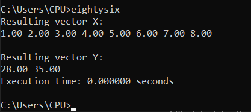

# x86-to-C-interface-programming-project

## Execution Time Comparison:

### x86:

- 2^20: 0.0143 seconds
- 2^24: 0.2485 seconds
- 2^30: 17.0843 seconds

### C:

- 2^20: 0.0189 seconds
- 2^24: 0.2485 seconds
- 2^30: 21.9918 seconds

In this case, the x86 version is always faster than the C version. This may be due to x86 operating closer to the hardware than C.

## Screenshots:

### C Version

### x86 Version

- The following test cases were tested with sizes 8 and 2^20. It could be noted that the max number could be simplified to 7 * (n - 3).

- However, in the event when n = 2^30. All resultant vectors show the result of 7516192768, which is equal to 7 * 2^30. Not only that, all of the vectors display the same number as if there was no possible number afterwards.